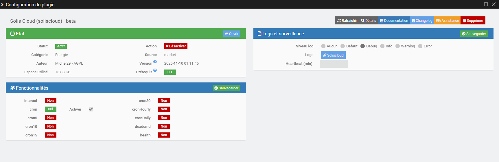
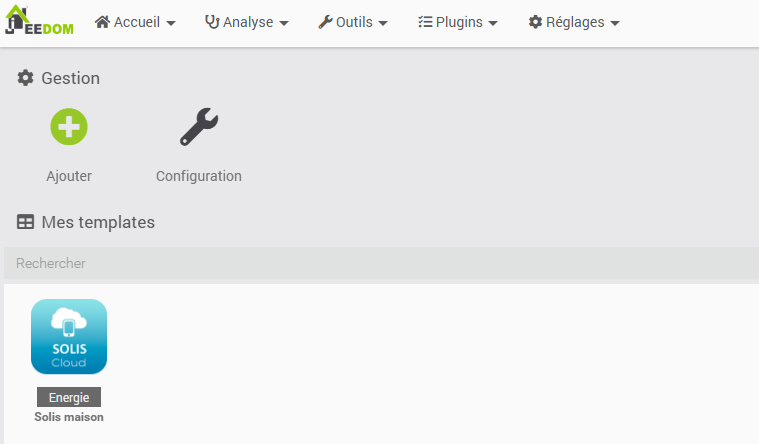
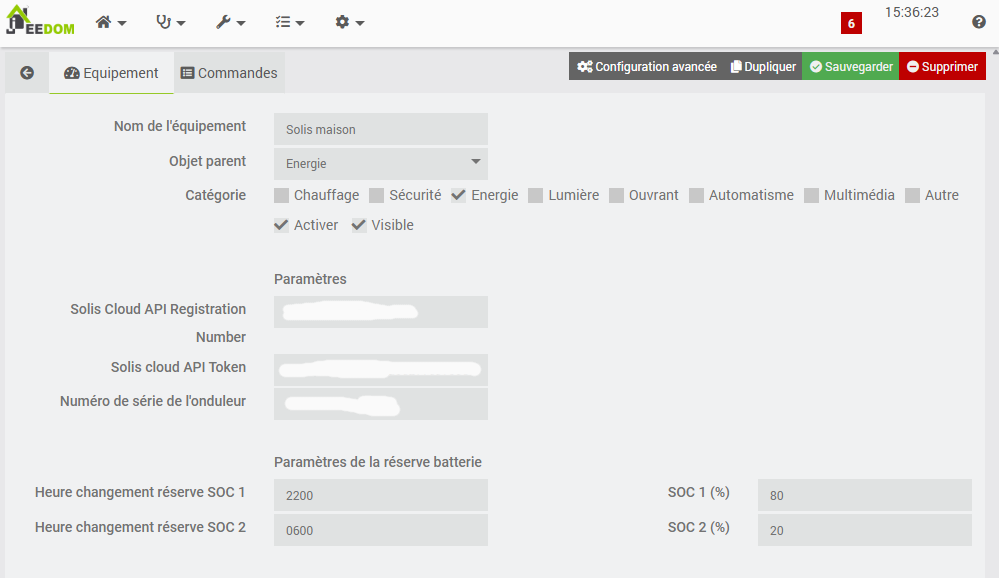
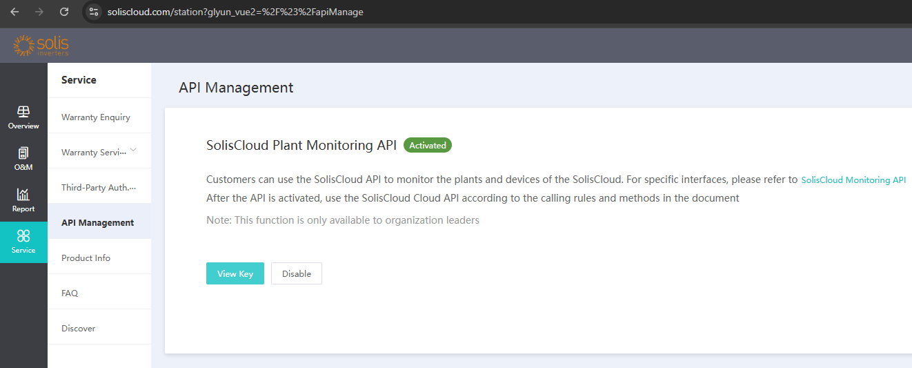
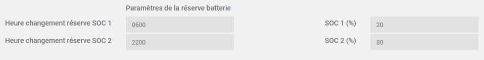

   

Présentation
===
Le plugin Solis cloud permet de récupérer les informations de votre onduleur monitoré par le site https://www.soliscloud.com/.

Pré-requis:
===
Pour pouvoir récupérer les informations de votre onduleur, il faut un onduleur compatible connecté à la plateforme cloud Solis.

Liste non exhaustive des onduleurs pris en compte à l'heure actuelle:

 

| Onduleurs supportés                      | Observations                                                                                                                  |
|------------------------------------------|-------------------------------------------------------------------------------------------------------------------------------|
| SOLIS S5-EHP1P(3-6k)K-L                  |                                                                                                                               |
| SOLIS S6-EHP1P(3-6k)K-L                  |                                                                                                                               |
| ...                                      |                                                                                                                               |

La documentation complémentaire sur les API des onduleurs se trouve dans [le répertoire onduleurs](docs_onduleurs).

 

Installation du plugin
===
Installer le plugin à partir du Jeedom market. Vous pouvez choisir la version stable ou la version Beta pour obtenir les dernières mises à jour.

Configuration générale du plugin
==

Activez bien un des cron pour activer la fréquence d'interrogation de l'onduleur.
 

Création d'un nouvel équipement
==

Cliquer sur le + "Ajouter"

## Paramétrage de l'équipement:
 

 
Les premiers champs sont classiques.

Ensuite, il faut que vous saisissiez l'API registration number et le token que vous trouverez sur votre compte du portail Solis https://www.soliscloud.com/ comme présenté dans l'écran ci-dessous puis cliquer sur "View Key".

Si vous ne trouvez pas ces identifiants sur le portail Solis, il faut demander au support Solis d'activer la clé d'API pour votre compte Solis.

Ensuite saisissez l'identifiant de l'onduleur au format base 10 (et pas au format hexadécimal). Voici un exemple de convertisseur : https://sebastienguillon.com/test/javascript/convertisseur.html 

## Paramétrage de la réserve batterie:

Ces parametres, permettent de faire varier la réserve de la batterie pour par exemple forcer la charge de la batterie durant les heures creuses l'hiver. Le principe est de définir des plages de recharges à partir du réseau sur l'onduleur. Pour éviter la décharge durant les heures cruses, il faut augmenter le taux de réserve sur la batterie. 

Par exemple, si vos heures creuses débuttent à 22h et se terminent à 6h, il vous suffit de fixer la réserve à 80% à 22h et la rétablir à la valeur minimale souhaité à la fin des heures creuses (ici 20%)

 

Remerciements
===

Merci à @phroc qui a développé le plugin solax cloud duquel je me suis inspiré.

Bug
===

En cas de bug sur le plugin il est possible de demander de l'aide :

[https://community.jeedom.com/c/plugins/energy/50](https://community.jeedom.com/c/plugins/energy/50)

